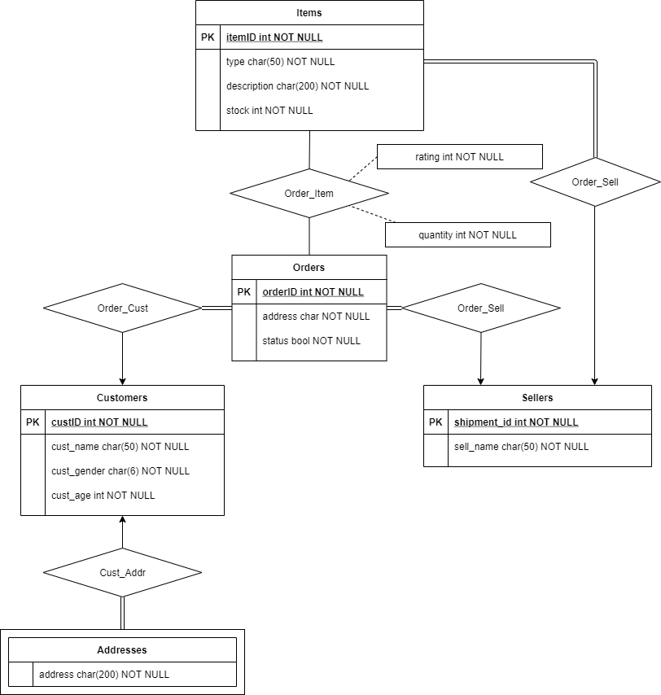

# e-commerce-analytics
Group project for CSC3170 (Database System)

## ER Diagram of the database

## Components

Our E-commerce analytic system is based on [MySQL Connector/Python](https://github.com/mysql/mysql-connector-python) and the [Bokeh](https://bokeh.org/) GUI library. The system roughly comprises of three components:

- A MySQL database recording information about buyers, sellers, goods, transactions, etc.
- An analytic system (classes) of the above E-commerce data by internally calling MySQL queries.
- A web GUI that provides data visualization and easy interaction with the system.
